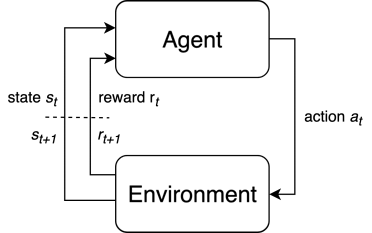

介绍
=================

## 强化学习简介

**总问题**：在环境中为实现优化目标做出序列决策。

图1：强化学习MDP问题整体框架

**要素**：状态$s_t\in \mathcal{S}$，动作$a_t\in\mathcal{A}$，奖励$r_t\in\mathcal{R}$。

**条件**：马尔可夫性：后一个状态仅依赖于前一个状态，即$s_{t+1}\sim P(s_{t+1}|s_t,a_t)$。满足此性质的决策问题称为马尔可夫决策过程（Markov decision process，MDP），绝大多数的决策问题都满足此条件，本教程也只考虑MDP问题的求解。

**要学习的函数**

一个智能体为了实现最大化的总回报，要做出一系列的决策。这些决策可以用一些函数来表示和生成：
- 策略函数$\pi:\mathcal{S}\rightarrow\mathcal{A}$，表示智能体在某状态下要执行何种动作的函数。
- 价值函数$V^{\pi}(s)$或$Q^{\pi}(s,a)$，作为期望收益$\mathbb{E}_\tau[R(\tau) ]$的估计。
- 环境模型$P(s' | s,a)$，表示在某种状态下做出某种动作时向下一个状态转移的概率。

策略函数是最直接的生成策略的依据。例如AlphaGo的走子网络：根据当前棋盘局面（状态）判断下一手的位置。价值函数表示的是每一种可能的状态或行动能带来多大收益，用于间接生成策略，生成的方式可以是贪心的——每一次行动都按照当前最大的收益来实施，也可以是$\epsilon$-贪心的——由于价值函数的估计并不一定反映真实情况，我们只以$\epsilon$的概率实施贪心策略，同时以$1-\epsilon$的概率探索新策略来丰富价值函数的估计。环境模型表示智能体对环境的认识，并由此能够预测自己的行动能够带来什么影响。

## 深度强化学习算法

深度强化学习对经典强化学习的提升在于，使用“最强函数拟合器”深度神经网络来表示要学习的函数。根据不同算法使用深度神经网络来表示的函数不同，Deep-RL算法可以分成如下的类别：

基于策略的方法：
- REINFORCE

基于价值的方法：
- SARSA
- DQN：Deep Q-Network
- Double DQN
- DQN + Prioritized Experience Replay 先验经验回放
- QT-OPT

基于模型的方法：
- iLQR：Iterative Linear Quadratic Regulator
- MPC：Model Predictive Control
- MCTS：Monte Carlo Tree Search

价值和策略结合的方法：
- Actor-Critic：
  - A2C：Advantage Actor-Critic
  - GAE：Actor-Critic with Generalized Advantage Estimation
  - A3C：Asynchronous Advantage Actor-Critic
- TRPO：Trust Region Policy Optimization
- PPO：Proximal Policy Optimization
- SAC：Soft Actor-Critic

模型和价值或和策略结合的方法：
- Dyna-Q / Dyna-AC
- AlphaZero
- I2A：Imagination Augmented Agents
- VPN：Value Prediction Networks